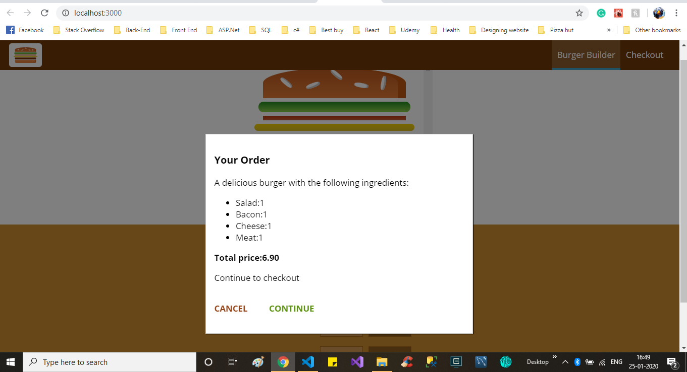

# Burger Builder A SPA React application

## **This project is still in progress but still you can understand the functionality by following screen-shots. This project allows user to create their own custom Burger and place an order for check out.**

## **Technologies used in this project**

-**Front End**: ReactJs,React-Router,Redux,React-hooks,Javascript,CSS,HTML

-**back End**: FireBase,Axion Library for API calls

### Home Page

-As we can see the home page has option of

- Adding ingredients (Salad,Bacon,Cheese,and Meat)
- Order Now
- CheckOut (Currently in progress with backend API)

        #### Functionality on Home Page

  

- As user adds ingredient the **Less** Button changes its status from **disable** to **Active**
- Current price also increses as per Ingredients in burger.

### Order Now

- In Order now when user clicks on **Order Now** button. A order summary drops down to screen with brief detail of order and price.

- User can continue from there to check out or cancel it for more edit by clicking **Cancel** button Or clicking any where on dark screen except order summary menu.

### Respponsive web Design

- This project also made in mobile first approch.
- It has Hamburger Navigation symbol appears in navigation bar.(less than 500px size devices)

### Checkout (Still in progress with Backend part)

### Thanks for stopping by and reviewing my work :)
